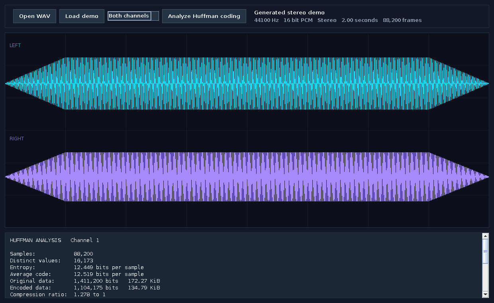
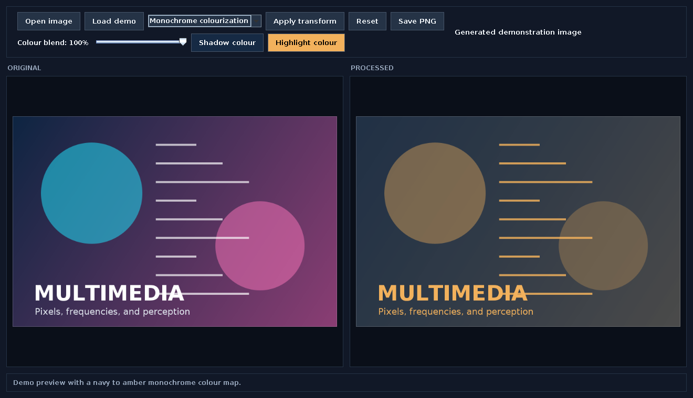

# Multimedia Systems Lab

Two Java desktop tools for exploring how multimedia data is represented, transformed, and compressed.

The audio explorer reads PCM WAV files, separates their channels, draws the waveform, and runs a complete Huffman encode and decode cycle. The image studio explores YUV colour processing, monochrome colourization, dithering, block DCT compression, and a two dimensional Fourier transform.

This is an original reimplementation inspired by concepts I studied in SFU CMPT 365. It does not contain course instructions, starter code, grading data, or material from my original submissions.

## What you can explore

### Audio and Huffman Explorer

- Open uncompressed PCM WAV files with one or two channels
- Inspect sample rate, bit depth, duration, and channel count
- View left and right waveforms together or separately
- Build a Huffman tree from a selected channel
- Measure entropy, average code length, and estimated compression ratio
- Encode and decode the channel in memory, then verify every recovered sample

### Image Transform Studio

- Open PNG, JPEG, BMP, or GIF images
- Convert an image to grayscale
- Adjust brightness in the Y channel without directly changing chroma
- Scale U and V chroma while retaining image luma
- Colourize monochrome images with a selectable shadow and highlight palette
- Apply a four by four ordered dither
- Apply Floyd Steinberg error diffusion
- Compress each colour channel with eight by eight DCT blocks
- Adjust DCT quality and inspect PSNR
- View a logarithmic Fourier magnitude spectrum
- Save the processed image as PNG

## Run it

You need JDK 17 or newer.

On macOS or Linux:

```bash
./scripts/build.sh
./scripts/run.sh
```

On Windows PowerShell:

```powershell
./scripts/build.ps1
./scripts/run.ps1
```

The application opens with generated demo media, so you can try every feature without finding sample files first.

## Screenshots





## Test it

```bash
./scripts/test.sh
```

```powershell
./scripts/test.ps1
```

The test suite verifies WAV parsing, lossless Huffman reconstruction, YUV channel behaviour, colourization endpoints, binary dithering output, DCT image dimensions, and Fourier spectrum generation.

## Project structure

```text
src/main/java/ca/ernestwong/multimedia
  audio       WAV parsing, Huffman coding, and waveform UI
  image       Dithering, DCT, Fourier processing, and image UI
  ui          Shared visual components and styling
  demo        Generated audio and image samples

src/test/java
  Small dependency free algorithm tests

docs
  Architecture and interview learning notes
```

## Design choices

- Java Swing keeps the applications portable and dependency free.
- WAV parsing is implemented directly from RIFF chunks instead of hidden behind an audio library.
- Huffman coding includes real bit packing and decoding, not only a theoretical bit count.
- YUV controls separate perceived brightness from colour information so each can be studied independently.
- Monochrome colourization maps luminance through a user-selected two-colour ramp and supports partial blending.
- DCT is applied to each colour channel in eight by eight blocks using a quality scaled quantization table.
- Fourier transforms use an iterative radix two FFT after resizing the image to a power of two.

See [Architecture](docs/ARCHITECTURE.md) for the data flow and [Learning Guide](docs/LEARNING_GUIDE.md) for an interview friendly explanation of each algorithm.

## Limitations

- WAV input is limited to uncompressed PCM with 8 or 16 bit samples and up to two channels.
- Huffman results describe sample data only. A production file format would also store its codebook and metadata.
- DCT compression demonstrates the transform and quantization stages. It does not create a JPEG file.
- Monochrome colourization is an artistic luminance mapping tool. It does not infer the original or semantically correct colours in a scene.
- Large images are scaled to a manageable power of two before Fourier processing.

## License

MIT
